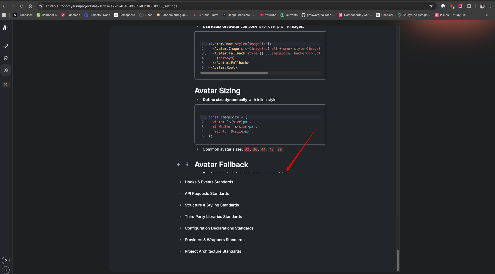
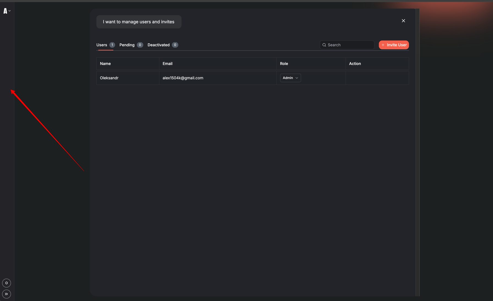
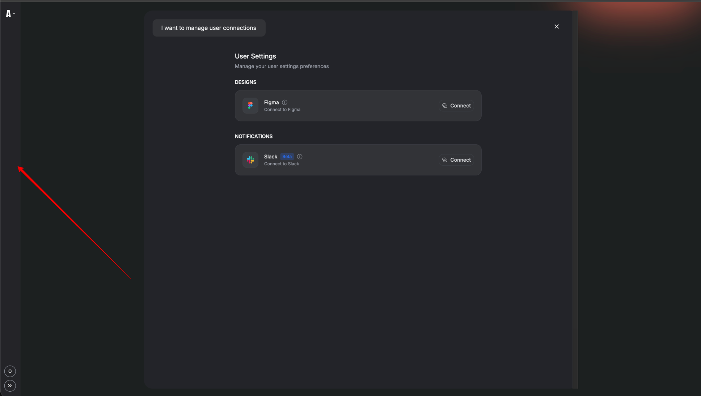
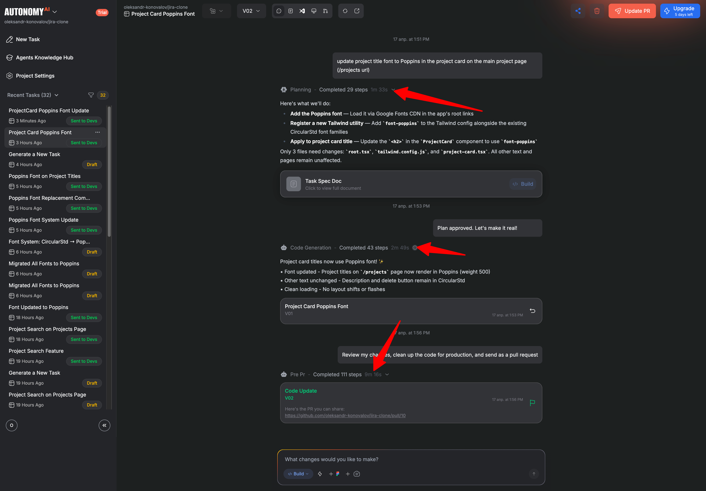
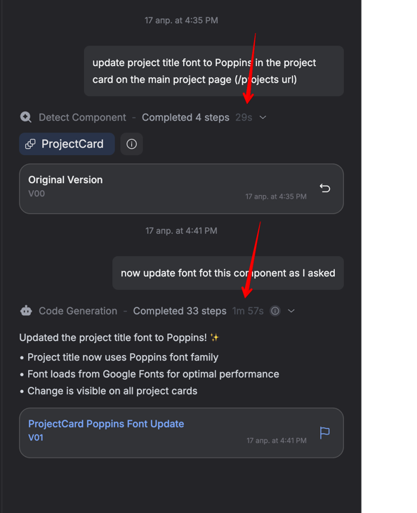

# 🐛 Bug Reports

---

## Bug #1

### 📋 Title

Coding Standards' Accordions' Content is Cut Off in Rich Editor

### 🔴 Severity

**Major**

### 📝 Description

The height of accordion blocks in the Coding Standards tab is limited, preventing users from viewing and editing all content within large standards. This blocks users from applying changes to parts of the standard that extend beyond the visible area.

### 🔧 Steps to Reproduce

1. Log in as a user who has a connected project
2. Navigate to **Sidebar** → **Project Settings** button → **Coding standards** tab
3. Click on any standard anchor that has a large amount of content inside and apply Rich Editor
4. Scroll down to the end of the block

### ❌ Actual Result

- The height of the block is limited
- Not all content is visible
- User cannot update any part of the standard that extends beyond the visible area
- 

### ✅ Expected Result

- User should be able to apply changes in any part of the standard content
- Suggested solution: Add vertical scroll for such blocks to allow full content access

---

## Bug #2

### 📋 Title

Poor Frontend Performance When Switching to Coding Standards Tab

### 🟡 Severity

**Minor**

### 📝 Description

The Coding Standards tab exhibits significant performance issues during navigation. Tab switching is laggy with a 2-3 second delay, and the overall page performance is critically low according to Lighthouse metrics (25 on desktop, 27 on mobile).

### 🔧 Steps to Reproduce

1. Log in as a user who has a connected project
2. Navigate to **Sidebar** → **Project Settings** button → any tab (except Coding standards)
3. Click on the **Coding standards** tab

### ❌ Actual Result

- Animation is laggy during tab transition
- Tab redirection takes approximately 2-3 seconds
- Lighthouse performance score: **25 on desktop**, **27 on mobile**
  - FCP: 55301ms
  - SI: 55301ms
  - FMP: 4000ms
  - TTI: 65675ms
  - FCI: 6500ms
  - LCP: 65675ms
  - TBT: 2152ms
  - CLS: 0

### ✅ Expected Result

- Coding standards tab should load much faster
- Tab navigation should work smoother with no noticeable lag
- Performance score should be significantly improved

### 💡 Notes

- Consider async data loading with skeleton loader
- Evaluate browser caching strategies
- Reference: [Lighthouse Report Calculator](https://googlechrome.github.io/lighthouse/scorecalc/#FCP=55301&SI=55301&FMP=4000&TTI=65675&FCI=6500&LCP=65675&TBT=2152&CLS=0&device=desktop&version=13)

---

## Bug #3

### 📋 Title

Missing Sidebar on Users and Integrations Pages

### 🔴 Severity

**Major**

### 📝 Description

The sidebar navigation is absent on the User Settings and Manage Users pages. Users are unable to navigate to other modules or pages without closing the modal via the X icon, significantly impacting navigation experience.

### 🔧 Steps to Reproduce

1. Click on the arrow button next to the logo → **"Users"** button
2. Click on the **Sidebar user profile icon** → **User settings** button

### ❌ Actual Result

- Sidebar is absent on the User Settings page
- User has to close the modal via X icon to navigate to another page/module
- No navigation options available from the sidebar
  
  

### ✅ Expected Result

- Sidebar should be displayed on **User Settings** page
- Sidebar should be displayed on **Manage Users** page
- Users should be able to navigate freely between modules without closing modals

---

## Bug #4

### 📋 Title

Slow Generation Process in Fast Mode

### 🔴 Severity

**Major**

### 📝 Description

The Fast mode generation process is significantly slower than expected for simple tasks. Even minimal changes (e.g., font modifications) can take up to 30 minutes to complete, with time-consuming analysis, generation, and polishing phases. This defeats the purpose of the "Fast mode" feature.

### 🔧 Steps to Reproduce

1. Create a new task for any connected project
2. Select **Fast mode**
3. Provide an easy prompt for minimal changes (e.g., changing font for some heading)
4. Proceed through the full lifecycle

### ❌ Actual Result

- Simple tasks in Fast mode can take up to **15-20 minutes** to complete
- Analysis, generation, and polishing phases are time-consuming
- Performance is inconsistent with the "Fast mode" designation
  

### ✅ Expected Result

- Analysis, generation, and polishing phases should be significantly improved
- Fast mode should deliver results in a reasonable timeframe
- Performance should be comparable to using Find tool initially followed by Build (which takes only up to 10 minutes for the same work)

### Risk

- User experience is negatively impacted by slow performance
- User can be discouraged to use Fast mode due to long processing times
- User may not be able to complete tasks in a timely manner
- Refund policy may be affected by slow processing times

### 💡 Notes

- Current workaround: Using Find tool initially followed by Build achieves the same result in ~5 minutes
- Investigate optimization opportunities in analysis, generation, and polishing phases
- Consider caching mechanisms or parallel processing to improve performance
  

---
